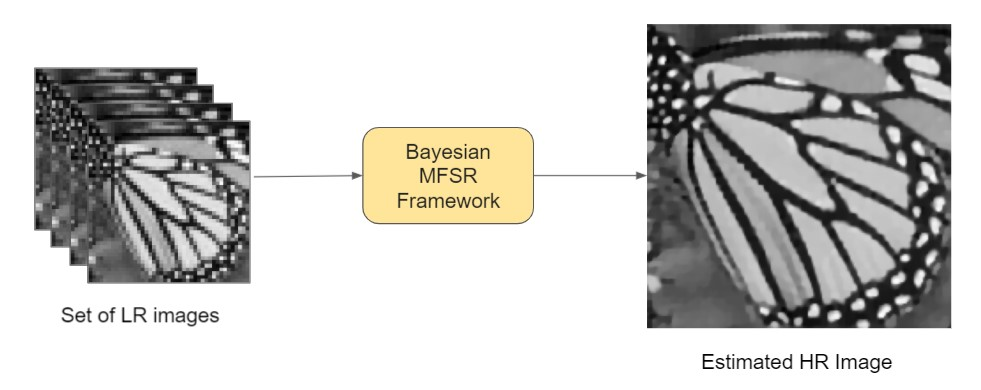
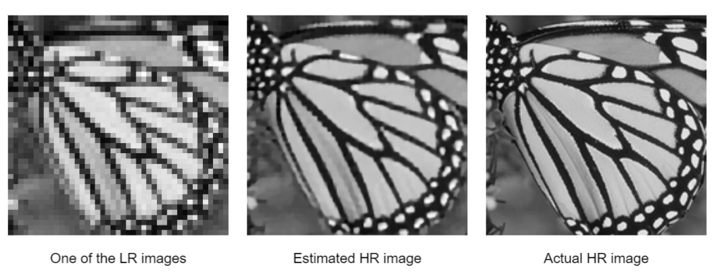

<h1 align="center">Bayesian Image Super-Resolution</h1>

  </img>

A Bayesian framework for Multi-Frame Image Super-Resolution, based on ["Bayesian Image Super-Resolution" (ME Tipping and CM Bishop, NeurIPS 2003)](https://papers.nips.cc/paper/2315-bayesian-image-super-resolution.pdf). 
  
For more details, check out:
- [Report](report/report.pdf)
- [Presentation](presentation/main.pdf)

## Results Overview

  </img>

## Visualization of the HR Image Estimation

  </img>

## Authors
- [Harshit Varma](https://github.com/hrshtv)
- [Gaurav P](https://github.com/gaurav638012)

---
*(This was done as a course project for CS736: Medical Image Computing, Spring 2021, IIT Bombay)*
